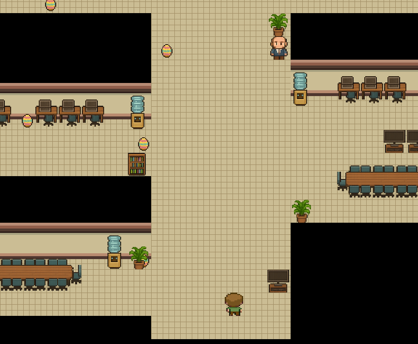

# 🐣 Easter Search RPG

_Easter Search RPG_ is a retro-inspired mini adventure where you explore a pixelated office environment in search of hidden Easter eggs.  
Built entirely with **pure HTML, CSS, and JavaScript** – no frameworks, no dependencies, just classic browser fun!



## 🎮 Features

- Move around the office using `W`, `A`, `S`, `D`, `⬆️`, `⬅️`, `⬇️`, `➡️` or a touch D-Pad for mobile
- Find all **10 hidden Easter eggs**
- Talk to NPCs for clues
- Interact with desks, bookshelves, laptops, and more
- Classic 16-bit style grid movement and visuals

## 🚀 Live Demo

👉 **[Play now](https://easter.manuelweb.at)**  
(No installation needed – runs directly in your browser!)

## 🧱 Tech Stack

- HTML5
- JavaScript
- Pure CSS (pixel grid background, gradient-based walls)
- Custom-generated 16-bit sprites and retro tile styling

## 📦 Run Locally

```bash
git clone https://github.com/manuelhintermayr/easter-webgame
open index.html
